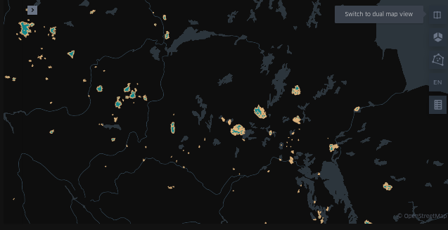
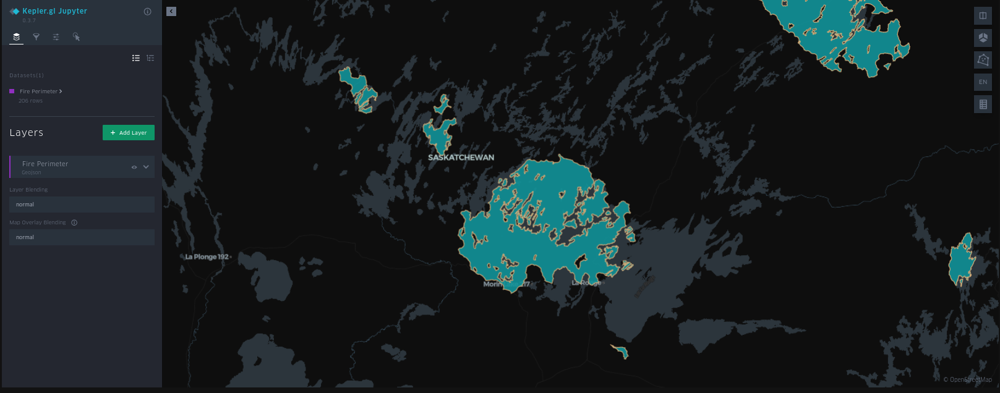
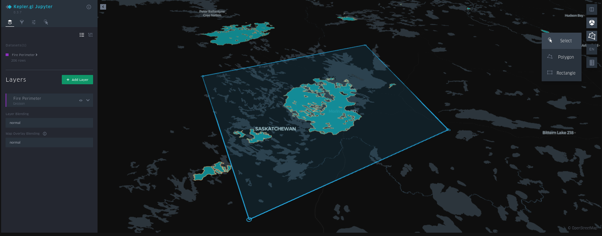
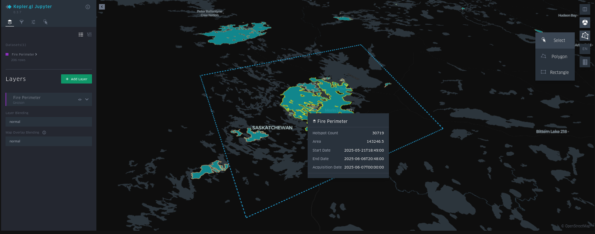

# Wildfire Analytics Project

## Table of Contents
- [Description](#description)
- [Tech Assets and URLs](#tech-assets-and-urls)
- [Installation](#installation)
- [Usage](#usage)
- [Features](#features)
- [Data Sources](#data-sources)
- [Troubleshooting](#troubleshooting)
- [Costs Involved](#costs-involved)
- [Passwords and Credentials](#passwords-and-credentials)
- [Contact Information](#contact-information)

## Description
The **Wildfire Analytics Project** is a geospatial data platform designed to monitor, analyze, and visualize wildfire risk and activity across Canada. The project consolidates multiple environmental datasets including satellite imagery, WFS/WCS layers, and geospatial tables into a unified PostgreSQL database with PostGIS support. It supports both research (machine learning and temporal forecasting) and decision-making (frontend dashboards for fire danger assessment and real-time alerts). The project is aimed at extending and enhancing tools like the CWFIS interactive map with richer analytics and ML-ready feature pipelines.

---

## Tech Assets and URLs

| Component          | Description                                                | Access/Location                                                                                                                                                         |
|--------------------|------------------------------------------------------------|-------------------------------------------------------------------------------------------------------------------------------------------------------------------------|
| **Frontend**       | Streamlit + Kepler.gl visualization dashboard              | `http://localhost:8000` (local)<br/>https://wildfire-app-848755338708.us-east1.run.app/ (cloud)<br/>Code in GitHub                                                      |
| **Backend API**    | FastAPI for data access                                    | Docker container on port 8001<br/>Hosted at https://wildfire-api-848755338708.us-east1.run.app<br/>Code in GitHub                                                       |
| **Database**       | PostgreSQL with PostGIS                                    | Hosted on Google Cloud SQL<br/>Can be access via: 34.23.205.32 Port 5432<br/>Connection String: postgresql://postgres:K2><X*T$Jad#gQg2@34.23.205.32:5432/postgres       |
| **Cloud Platform** | Google Cloud Run (or App Engine if scaled)                 | Google Cloud Console<br/>Please reach to Mackenzie Rock to be granted access to the project                                                                             |
| **Source Repo**    | Codebase with frontend, backend, infra                     | [https://github.com/FrogOnARock/WildfireCapstone]                                                                                                                       |
| **DockerHub**      | Used to host docker containers for use by Google Cloud Run | Frontend: https://hub.docker.com/repository/docker/frogonarock/wildfire-app/general <br/>API: https://hub.docker.com/repository/docker/frogonarock/wildfire-api/general |
---

## Installation

### Prerequisites
- Python 3.11
- Docker and Docker Compose + Docker Hub Account
- Google Cloud Account
- PostgreSQL with PostGIS (or use hosted instance)
- GitHub Account

### Required Python Packages
- `streamlit`, `fastapi`, `uvicorn`, `folium`, `psycopg2-binary`, `pandera`
- `sqlalchemy`, `geopandas`, `geojson`, `rasterio`, `shapely`, `dotenv`, `geoalchemy2`
- `streamlit-keplergl`, `keplergl`, `streamlit-option-menu`, `python-multipart`
- `pandas`, `matplotlib`, `requests`, `Pillow`, `pyyaml`, `jupyter`
- Optional: `mlflow`, `lightgbm`, `scikit-learn` for ML experiments

### Setup Instructions

```bash
# Clone the repository
git clone https://github.com/FrogOnARock/WildfireCapstone.git
cd wildfire_1

# Create and activate virtual environment
python -m venv venv
source venv/bin/activate  # Windows: venv\Scripts\activate

# Install Python dependencies
pip install -r requirements.txt
```

Setting up the docker containers:

- Please note that this will require a linux distribution. If you are on windows you will have to install WSL (Windows System for Linux). Once that is complete you can continue on with these steps:
- Please ensure that you have created two public repositorys on Docker Hub. You can name these however you would like. In this example they are named wildfire-app and wildfire-api.
```bash
#build the streamlit app docker container
sudo docker build -f Dockerfile.streamlit -t wildfire-app .

#build the API docker container
sudo docker build -f Dockerfile.fastapi --t wildfire-api .

#tag your images (not necessary)
sudo docker tag wildfire-app yourusername/wildfire-app:latest
sudo docker tag wildfire-api yourusername/wildfire-api:latest

#push your docker images
sudo docker push yourusername/wildfire-app:latest
sudo docker push yourusername/wildfire-api:latest
```
In Cloud Run on the Google Cloud Console you can now leverage these repositories to create your applications.

The container image URLs would be similar to: yourusername/wildfire-api & yourusername/wildfire-app

You can choose your settings for location and spec configuration.

---

## Usage

### Local

#### Required Code Changes

To run locally the following updates need to made within the code base:

- Each page within the streamlit application at /streamlit_app has to have an import line changed:

```python
from api_client import ...
```
to be changed to:

```python
from wildfire_1.app.api_client import ...
```

- The API_URL in /streamlit_app/api_client.py must be updated to:

```python
API_URL = 'http://localhost:8000'
```

#### Streamlit Frontend

Run:
```bash
streamlit run streamlit_app/Main.py
```

Access at: [http://localhost:8000](http://localhost:8000)

#### FastAPI Backend

Run:
```bash
uvicorn api.main:app --host 0.0.0.0 --port 8001
```
Access at: [http://localhost:8001/docs](http://localhost:8001/docs)

### Cloud

Having following the steps above to set up the docker images and cloud run you can access the application at the link provided to you by Google.

Example: https://wildfire-app-848755338708.us-east1.run.app


### Example Use

Very straightforward use. It is a dashboard and it gives you the freedom to choose the layer you would like to use. 
As an example please utilize the Fire Perimeters page. On this page select 'Get Fire Perimeter by Hotspot Count'
Choose the range of hotspots you would like. The minimum is 0 and the maximum is decided by the maximum value within the database.

Upon  choosing, select 'Run Query'. Following load a map will appear below this section. I would suggest
changing the map view twice. This will take you to a fullscreen representation. 



Upon switching you will be in fullscreen mode. You can utilize the arrow in the top left corner to make adjustments to the layers on the kepler.gl map.
These layers allow you to visualize the same dataset in multiple ways. 

!

For now I will leave them as they are as they represent the perimeter well. You can change to a 3 dimensional view at the 
top right and also add polygons are rectangles to the map. Showcasing it's capability to be used as interactive planner.



Hovering over the perimeter we can see the data that it represents.



Each layer can be used in the same way. Enjoy experimenting!

### WCS/WFS/Additional Layers Supported

Query via FastAPI for the following:
- `Active Fires (WFS)`
- `Fire Danger (WFS)`
- `Fire History (WFS)`
- `Fire Perimeter (WFS)`
- `Forecast Stations (WFS)`
- `Reporting Weather Stations (WFS)`
- `Reporting Weather Stations (Forecast) (WFS)`
- `Daily Severity Rating (WCS)`
- `Drought Code (WCS)`
- `Wind Speed (WCS)`
- `Fire Type (WCS)`
- `Initial Spread Index (WCS)`
- `Precipitation (WCS)`
- `Bulk Density - 5cm (Additional)`
- `Clay Percentage - 5cm (Additional)`
- `Landcover (Additional)`
- `Ph Levels - 5cm (Additional)`
- `Sand Percentage - 5cm (Additional)`
- `Silt Percentage - 5cm (Additional)`
- `Soil Organic Carbon - 5cm (Additional)`

---

## Features

- Wildfire detection and monitoring
- WFS/WCS ingestion and visualization
- Accessible postgreSQL database
- GeoTIFF raster processing (weather, terrain, soil)
- FastAPI endpoints for downstream consumption
- Streamlit dashboard with Kepler.gl integration
- Fully Dockerized and cloud-deployable

### Database
- Please refer to the documentation in READMEADD.md, READMEWCS.md, and READMEWFS.md for clear understanding of the database schema.
---

## Data Sources

| Dataset Category     | Source               | Description                                                                                                           |
|----------------------|----------------------|-----------------------------------------------------------------------------------------------------------------------|
| `WFS Datasets`       | CWFIS (NRCan)        | Vector geospatial services providing point and polygon features. Can be stored in `.geojson`, `.gpkg`, etc.          |
| `WCS Datasets`       | CWFIS (NRCan)        | Raster-based geospatial services providing continuous surface data. Processed as GeoTIFF, used in ML or visualization. |
| `Soil Types`         | Government of Canada | Soil property rasters (e.g., SOC, pH, sand, silt, clay), typically in 0–5 cm depth resolution.     |
| `Land Cover`         | Government of Canada | Land classification raster from national datasets future integration.|

---

## Troubleshooting

| Issue                             | Solution                                                                                                                                                                                                       |
|-----------------------------------|----------------------------------------------------------------------------------------------------------------------------------------------------------------------------------------------------------------|
| Port issues with Google Cloud.    | Ensure that the dynamic $PORT option is being used in the<br/>Docker file.                                                                                                                                     |
| Unable to access database locally | Ensure that your IP address has been added to the known<br/>IP addresses on Google Cloud. Or that 0.0.0.0 is acceptable (allowing<br/>all possible IP addresses)                                               | |
| Memory Issues processing data     | You can downsample the data being pulled in from WFS and WCS<br/>layers. Doing so reduces the quality of the data but will <br/>allow easier processing.                                                       |
| Slow Frontend                     | Ensure that both the API and Frontend are being hosted in your region.<br/>This will greatly reduce the latency faced by the frontend. Otherwise<br/>improve the memory and CPU capabilities of your instance. |

---

## Costs Involved

| Resource | Estimated Cost                                   | Billed To                 |
|----------|--------------------------------------------------|---------------------------|
| Google Cloud SQL (Postgres) | ~$40/month                                       | themackrock@outlook.com |
| Cloud Run Services (if used) | Free given usage (could increase to ~$5-10/month | themackrock@outlook.com  |

> Contact Mackenzie Rock for credit card and billing details

---

## Passwords and Credentials

There is only one required environment variable. It is provided above in the form of the connection string: 
'postgresql://postgres:K2><X*T$Jad#gQg2@34.23.205.32:5432/postgres'

___

## Contact Information
For any questions or concerns, please contact:

Name: Mackenzie Rock

Email: themackrock@outlook.com

GitHub: https://github.com/frogonarock
